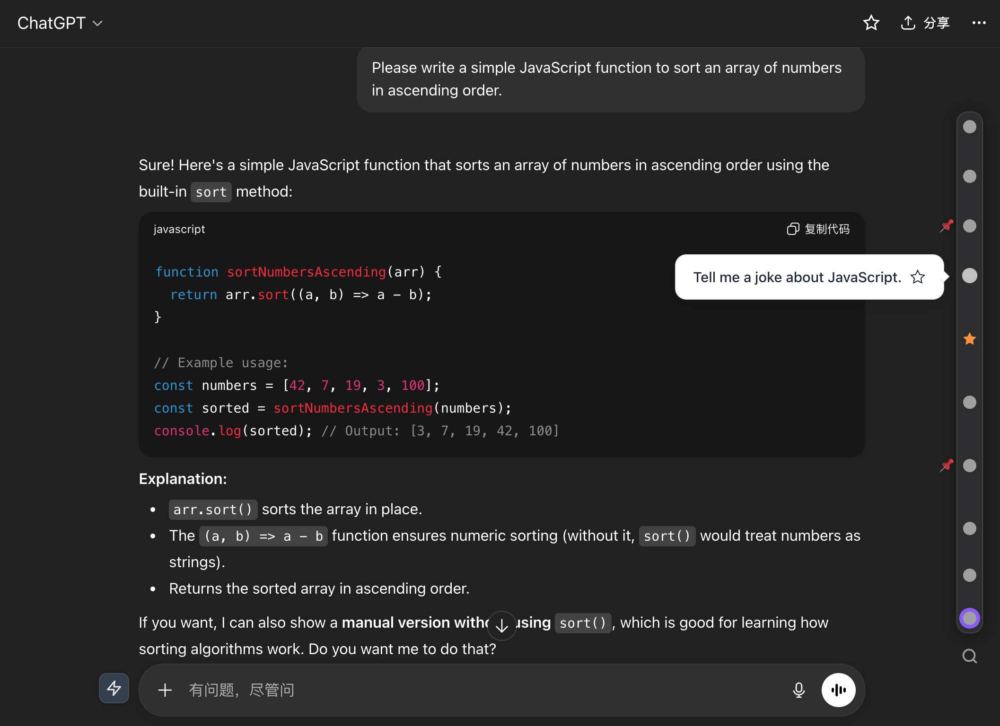

  
  <h1>AI Timeline</h1>

  

    
    
    
    
  

  <h4><a href="./README.md">简体中文</a> | <strong>English</strong></h4>

  
<strong>Boost your AI efficiency. When using AI in your browser, you'll need it. Trusted by 10,000+ users worldwide.</strong>

  

---

## ✨ Key Features

| Feature | Description |
|---------|-------------|
| 🎯 **Timeline Navigation** | Click timeline nodes to quickly jump to any conversation |
| 🧮 **Formula Extraction** | Intelligently identify formulas and extract their LaTeX |
| 🖼️ **Watermark Removal** | Remove Nano Banana watermarks from Gemini-generated images |
| ⭐️ **Smart Bookmarks** | Save important Q&As with notes and folder organization |
| 📌 **Page Bookmarks** | Bookmark entire chat pages for easy reference |
| 🔍 **Quick Preview** | Hover to preview conversation content without jumping |
| ▶️ **Code Runner** | Run AI-generated code with one click (JS/Python/SQL & more) |

## 🚀 Supported Platforms

<table>
  <tr>
    <td align="center"><strong>ChatGPT</strong></td>
    <td align="center"><strong>Claude</strong></td>
    <td align="center"><strong>Gemini</strong></td>
    <td align="center"><strong>DeepSeek</strong></td>
  </tr>
  <tr>
    <td align="center"><strong>Grok</strong></td>
    <td align="center"><strong>Perplexity</strong></td>
    <td align="center"><strong>Kimi</strong></td>
    <td align="center"><strong>Doubao</strong></td>
  </tr>
  <tr>
    <td align="center"><strong>Tongyi Qianwen</strong></td>
    <td align="center"><strong>Wenxin Yiyan</strong></td>
    <td align="center"><strong>Tencent Yuanbao</strong></td>
    <td align="center">More coming...</td>
  </tr>
</table>

## 📥 Installation

Visit 👉 [Chrome Web Store](https://chromewebstore.google.com/detail/timeline-ai-chat/fgebdnlceacaiaeikopldglhffljjlhh) to install. After installation, open any AI website and start chatting.

## 🌍 Language Support

Supporting **42 languages** with industry-leading coverage:

Click to view full language list

| Language | Code | Language | Code | Language | Code |
|----------|------|----------|------|----------|------|
| 🇬🇧 English | en | 🇨🇳 简体中文 | zh_CN | 🇹🇼 繁體中文 | zh_TW |
| 🇯🇵 日本語 | ja | 🇰🇷 한국어 | ko | 🇪🇸 Español | es |
| 🇫🇷 Français | fr | 🇩🇪 Deutsch | de | 🇮🇹 Italiano | it |
| 🇵🇹 Português | pt | 🇷🇺 Русский | ru | 🇳🇱 Nederlands | nl |
| 🇵🇱 Polski | pl | 🇹🇷 Türkçe | tr | 🇸🇦 العربية | ar |
| 🇮🇱 עברית | he | 🇮🇳 हिन्दी | hi | 🇹🇭 ไทย | th |
| 🇻🇳 Tiếng Việt | vi | 🇮🇩 Bahasa Indonesia | id | 🇲🇾 Bahasa Melayu | ms |
| 🇵🇭 Filipino | fil | 🇸🇪 Svenska | sv | 🇩🇰 Dansk | da |
| 🇳🇴 Norsk | no | 🇫🇮 Suomi | fi | 🇮🇸 Íslenska | is |
| 🇨🇿 Čeština | cs | 🇭🇺 Magyar | hu | 🇷🇴 Română | ro |
| 🇺🇦 Українська | uk | 🇬🇷 Ελληνικά | el | 🇧🇬 Български | bg |
| 🇭🇷 Hrvatski | hr | 🇷🇸 Српски | sr | 🇸🇰 Slovenčina | sk |
| 🇱🇹 Lietuvių | lt | 🇱🇻 Latviešu | lv | 🇨🇦 Français (CA) | fr_CA |
| 🇧🇩 বাংলা | bn | 🇰🇿 Қазақша | kk | 🇦🇿 Azərbaycan | az |

## 🗺️ Roadmap

- [ ] Firefox browser support
- [ ] Cloud sync

## 💬 Contact & Support

- **Issue Tracker**: [GitHub Issues](../../issues)
- **Email**: houyanchao@outlook.com

## 📄 License

This project is licensed under the [MIT License](./LICENSE)

## 🙏 Acknowledgements

This project is developed based on [chatgpt-conversation-timeline](https://github.com/Reborn14/chatgpt-conversation-timeline). We sincerely appreciate the original author's open-source contribution.

---

  
If you find this extension useful, please consider giving it a ⭐️ Star on GitHub!

